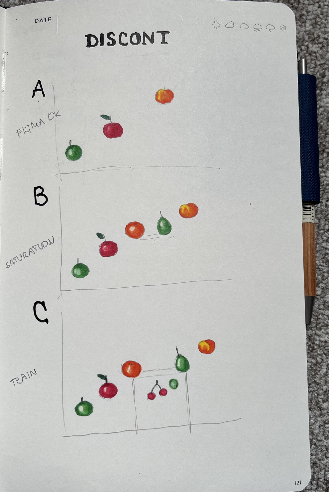

#   Discontinuity CRDT (DISCONT)

DISCONT is a greatly simplified CRDT algorithm that
fits into the constraints of an [LSM][l] merge operator.
DISCONT replaces CausalTree/RGA for Linear RDX elements.

The DISCONT algorithm is essentially merge sort using the
order of element IDs. That makes it comparable to Figma's
[ersatz-CRDT][f] in terms of simplicity. To make it an actual
CRDT, DISCONT makes a little twist which is more 
like a roundhouse kick, see below.

Implementation-wise, DISCONT is a [merge sort][m] using a heap of 
iterators. The technique is popular in the [LSM database world][c].
Although, if we would use any other merge sort implementation,
that will not change much. 
When merging versions of the state and patches, DISCONT
creates an iterator for each input, puts iterators in a heap
and... iterates like a merge sort should do. Importantly,
copies of elements get merged. Imagine two versions of an array;
those would naturally have lots of the same elements.

RDX has 128-bit element [IDs][i] consisting of a 64-bit sequence
number `seq` and a 64-bit replica id `src`. Those are essentially 
Lamport timestamps. The array type (`L`) additionally subdivides the `seq`
into 6 bit of "revision" and 64-6=58 bit "locator". The locator
(mainly) defines the position of a member element within the 
array thus enabling the *insert* operation. The revision part 
allows element versioning thus enabling *overwrites* and *deletes*.

Here is the Figma algorithm as the [authors][f] put it:

> At a high level, an object’s position in its parent’s array 
> of children is represented as a fraction between 0 and 1 
> exclusive. The order of an object’s children is determined 
> by sorting them by their positions. You can insert an object 
> between two other objects by setting its position to the 
> average of the positions of the two other objects.

So, by merge-sorting versions of an array in the order of labels 
while merging element copies we produce the new version of the array.
58 bits of `seq` is enough to run the Figma's algorithm for quite 
a long time before we encounter the situation of `IDleft+1 == IDright`
that prevents any further inserts at that point. Broadly, if
`IDright-IDleft < new_elem_count`, we cannot fit the inserted
elements into the data structure. (Here and later, we assume all
arithmetics is applied to locators; what is the value of `src`
is irrelevant at this stage.)

DISCONT resolves two key shortcomings of Figma's label-sorting
approach: 

 1. the requirement of ID space being dense (between any two
    ID values we can find a new one, `IDleft < IDnew < IDright`)
    RDX IDs are integers, hence not dense.
 2. the interleaving anomaly when concurrently inserted spans
    of elements go interleaved because of ID range overlap.

In both cases, the solution is to use insertion *trains* instead
of individual insertions. Assume we insert `k+1` elements 
`ID0, ID1, ... IDk` between `IDleft` and `IDright`. We call
`ID0` the train *head*, `IDleft < ID0 < IDright`. 
`ID1..IDk` we call the train's *tail*.
Very counter-intuitively, we assign tail IDs so that
`ID1 < ID2 < ... < IDk < IDleft`. In other words, 
we see an array as a concatenation of several monotonously 
sorted chunks and merge it that way. The entire ID sequence
may not be sorted. The key here is the handling of points of 
*discontinuity*, namely train heads. From the inner workings of
merge sort we may see: if the head gets selected and moved to
the output array, the tail will follow *immediately* as it
follows the head in the input and its IDs are *lower*!

For merge sort, that would be a bug: input arrays are not
fully sorted. For DISCONT, that is a feature!
That way, we only need one unclaimed ID to attach the head
to the original array. Also, interleaving can not happen.
Both issues of the Figma scheme are solved.

In case we do not plan to splice an array in the future, we
may use all-zero IDs for all the elements. In such a case,
we can only do overwrites, deletes and appends.

Overall, we win complexity wise, because CausalTree/RGA requires a
supplementary data structure and its computational complexity
is `O(NlogN)`. DISCONT only reads the inputs and its time
complexity is pure `O(N)`.
We can also compare DISCONT to Logoot, a true CRDT using
dense ID space (strings). With more complicated editing histories
Logoot IDs become longer and longer. DISCONT uses integer IDs,
which cause much slimmer overheads.

There is an additional expense though. Specifying DISCONT
patches requires more context than a single attachment point ID.
In fact, we may need to mention a sequence of head IDs to 
exactly locate the new element in an array. That feels a lot
like TreeDoc, of course. That is not only acceptable, but
also beneficial if we consider how merge works inside an LSM
engine. Patches may need to be merged to other patches before
being applied to the entire state; CT/RGA implementations
may find that requirement problematic.

[f]: https://www.figma.com/blog/how-figmas-multiplayer-technology-works/
[l]: https://en.wikipedia.org/wiki/Log-structured_merge-tree
[m]: https://www.geeksforgeeks.org/dsa/merge-sort/
[i]: ./id.go
[c]: https://github.com/apache/cassandra/blob/trunk/src/java/org/apache/cassandra/utils/MergeIterator.java#L101C8-L101C9

##  Growing and splitting text blocks

In application to collaborative text editing, changes are 
most often tracked on a per-letter basis. For efficiency, 
letters with sequential ids get packed into solid blocks.
In case a new letter has to be inserted in the middle of 
a block, the block gets split.

Overall, RDX implies word-based change tracking with the
assumption that sharing less-than-a-word is not worth it.
Still, both per-letter granularity and the block-splitting 
technique can be emulated in RDX.

As RDX Linear supports element overwrites, we may overwrite
a prefix of a word with a longer prefix, till the word is
complete. That gives the real-time per-letter experience.
LSM storage compacts overwrites, so this produces no long
term overhead.

Similarly, we may agree to ship sentence-long blocks and
split them into words in a deterministic way. That way, if
two editors split a sentence block concurrently, that
would produce exactly the same result. While editor appends
text, we grow a block, on the first insert we split it.

With these techniques, we effectively achieve the same
effect as CT/RGA sequential-ID blocks, minimizing the
metadata overhead for solid chunks of text. Whether the
gain is worth the complexity is a separate question though.

##  The pomological proof

This picture depends three main cases for DISCONT.
The vertical axis is the ID value, the horizontal axis is
the factual position in the array. So, arrays read left-
to-right.

  - Case A is the normal Figma numbering, no issues. Elements
    (green apple, red apple, peach) are sorted in the order of
    their IDs, everything is straightforward.

  - Case B is the moment of numbering space saturation. Elements
    orange and pear, once inserted, have IDs that differ by 1,
    so no new IDs can be inserted between them.

  - Case C is where we use the train-insertion technique to add
    two cherries and a grape; their IDs are lower than the orange
    and the pear have.

Now, imagine we merge any number of versions of that array.
All versions fall into one of the classes: A, B, or C. Those that
have the orange are B, those that also have a cherry are C.
Let's think how merge sort would process all these inputs.
(Note that our version of merge sort merges copies of the same element.)
In case we have no C inputs, there is nothing to talk about,
merge sort works normally.

Now suppose we have B and C inputs. Apples will be merged just fine,
there is no intrigue. Then, copies of the orange will be merged.
Then, the train will immediately follow because IDs of its elements
are lower than the ID of the orange, so if the orange "won" in the
comparison, the cherry will win immediately next. We may have several
C inputs with varying numbers of elements in the train, but the cherry
train will be definitely handled before we get to the pear.

Now suppose we have A, B and C inputs. In such a case, there is no
intrigue either; as the orange is present in the inputs, its turn
will be after the apples, before the pear, so the cherry train will
be processed in the right order, immediately after the orange.

This logic applies recursively, we may add another nested train
between the cherries and the grape. Similarly, we may add several
insertion trains at the top level.

The key trick is: once the head of the train (the orange) is present,
it orders normally in the top-level array, and its train immediately
follows.

Potentially, we may mess things up in several ways. First of all,
we may execute the algorithm incorrectly and that will lead to
really bad consequences, as train insertion is more fragile than
regular Figma-style element sorting. But this case is on the "data
corruption" side. There are subtler issues, e.g. interleaving.
No matter whether we do it at the top level or in any train,
suppose we concurrently do non-train insertion of many elements into
the same spot. Then their relative order in the resulting sequence 
is basically random. It will depend on the choice of IDs by those
who inserted the elements. They may oven overwrite each other in
case we skip the `src` part of the ID (that is allowed in RDX).

Overall, our choice of train vs plain insertions and the choice of
IDs for the new elements both depend on the semantics of the collection
in question. These things have to be handled carefully at a higher
level where user intention is more clear. For example, we may want
for concurrent insertions to overwrite each other, e.g. in the case
of typo correction "baguete"->"baguette" done concurrently by two
users we do not want "baguettte" as a result (the case of CT/RGA).
DISCONT provides some options here which have to be handled 
carefully. 

Finally, RDX does not prescribe granularity of the edits;
it can work per-letter, per-word or per-line, there is no difference.
So, all that nuance is left for higher-level code to sort out.
