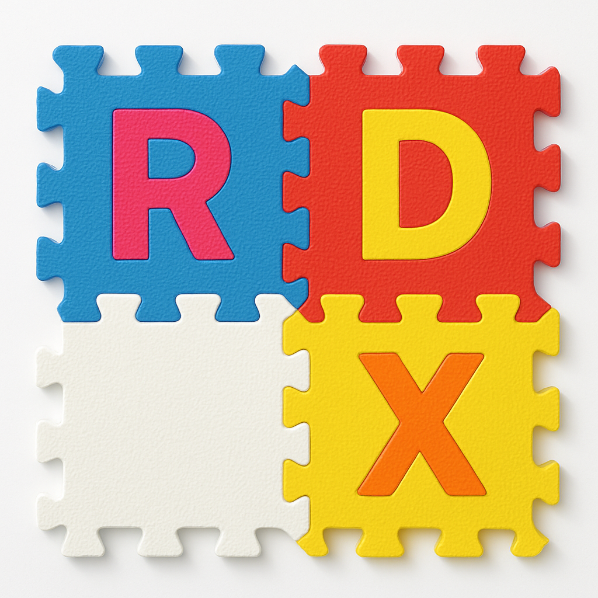

#   RDX: Replicated Data eXchange format

RDX is a bit-precise data replication and synchronization format.
Technically, RDX is a JSON superset with CRDT merge operation defined.
The spec guarantees that any RDX implementations:

 1. interpret RDX data, be text or binary, in exactly the same way, and 
 2. can merge any two documents, all producing exactly the same result.

Neither JSON nor CBOR provide guarantees of [identical reading][f]
between implementations, not to mention diff/patch/merge operations.
That makes the outcomes implementation-dependent, thus uncertain.
The multitude of "JSON superset" formats do not improve on that front
either, mostly focusing on the syntax and the supported types.

The formats used by BitTorrent, BitCoin or `git` all guarantee bit-precise 
results only at the level of *immutable binary blobs*.
Consider `git` merges: those are human-in-the-loop non-deterministic acts.
RDX provides deterministic bit-precise results for *mutable structured data*.
That affects the reproducibility, portability, interoperability, and
security properties of anything using the format.

The way RDX makes that guarantee is:

 1. Limited, but arbitrarily composable primitives; no feature sprawl.
 2. Careful bit-precise specification; formal grammars and defined limits.
 3. Controlled invariants and issue detection/resolution if 1-2 fell short.

Controlled invariants are the key feature. Any spec has ambiguities, any
code has bugs. We declare key invariants an RDX implementation MUST satisfy.
For example, there must be cross-implementation round-trip guarantee for
binary (RDX) to text (JDR) format conversions. RDX implementations would
be checked and cross-checked by any means available, so any developer can
rely on that equivalence. Similarly, RDX guarantees that the result of 
a merge is fully immune to reordering and/or duplication of updates, etc.

Performance-wise, RDX logic can fit into the constraints of a merge 
operator in a commodity LSM database (RocksDB, Pebble, Cassandra, etc).
Essentially, it can turn any database into a CRDT database.

##  Element types

RDX has five "primitive" `FIRST` types, all defined in the least
surprising way: 

  - Float (IEEE 754, no `NaN`s),
  - Integer (`int64_t`), 
  - Reference (128 bit Lamport ID), 
  - String (UTF-8), and
  - Term (`true`, `null` etc).

The text-based JDR format reuses JSON primitives with minor changes.
The binary RDX is little-endian with zipint compression.
On top of that, there are four `PLEX` container types which allow for
arbitrary nesting: 

  - tuPles: `("tomates rondes", 1, kg, 3.14)`,
  - Linear containers: `[1, 2, 3]`,
  - Eulerian sets `{A, B}` and/or maps `{1:one, 2:two}` and 
  - multipleXed containers: version vectors, counters. 

This minimalistic type system is what one should reasonably expect,
except maybe for multiplexed containers. Those are ordinary in the 
context of distributed systems. Also, any RDX element can bear
a Lamport timestamp, e.g. `("tomates rondes", 1, kg, 3.14@bob-25A1)`.
Similarly, that is necessary for versioning in a distributed system.

The binary RDX format is the most straightforward [type-length-value][t]
with one byte standing for record *type*, 1 or 4 bytes for value *length*.
Further, the first byte of the *value* specifies the record's *timestamp*
length thus separating it from the *payload*. That puts the typical
overhead to 3 bytes per element. Here, RDX prioritizes simplicity over 
efficiency.

The following section contains the detailed breakdown of the types
and their serialization formats.

### FIRST

A last-write-wins register is the simplest CRDT data type to implement.
It is also the most popular type in practical use.
For each LWW element, we only pick its latest "winner" value.
An RDX element of any type has a logical timestamp attached.
So, picking the latest revision is straightforward.
For the RDX timestamp/ID/reference inner structure, see the respective
section below.
In the binary RDX, Float, Integer and Reference payloads use a 
variable-length integer serialization scheme named *zip-ints*, see below.
Strings are UTF-8 and Terms are Base64 ASCII.
Overlong encodings are forbidden both for UTF-8 strings and for zip-ints.
There must be only one correct way to serialize a value.

| Type                            | JDR      | RDX                        |
|---------------------------------|----------|----------------------------|
| Float: 64 bit IEEE float known  |`1.23e+2`|`66 0400  027a03`           |
| as "double" in most languages,  |`-0.1E-1` |`66 0900  fd215e87e27528de` |
| as "Number" in JSON.            |`1.2`     |`66 0900  fccfcccccccccccc` |
|---------------------------------|----------|----------------------------|
| Integer: 64 bit two's complement| `0`      |`69 0100  `                 |
| integer, a.k.a. `int64`         | `-4`     |`69 0200  07`               |
|                                 |`65536`   |`69 0400  000002`           |
|---------------------------------|----------|----------------------------|
| Reference, 128 bit UUID/ Lamport|Alice-123 |`72 0900  83100000e9d9c20a` |
| timestamp, written in RON Base64|0-232BKMEDHz|`72 0a00  7ed43816b508830000`|
|                                 |0-0       |`72 0100`                   |
|---------------------------------|----------|----------------------------|
| String, UTF-8 string            |"Hello"   |`73 0600  48656c6c6f`       |
|                                 |"код"     |`73 0700  d0bad0bed0b4`     |
|---------------------------------|----------|----------------------------|
| Term, Base64 literal            | null     |`74 0500  6e756c6c`         |
|                                 | true     |`74 0500  74727565`         |
|---------------------------------|----------|----------------------------|

### PLEX

Collection types allow for arbitrary bundling and nesting of `FIRST` values and other collections.
The JDR syntax for PLEX collections is simply brackets: `()` `[]` `{}` and `<>`, respectively.
Elements inside the brackets can be separated by either a comma or some whitespace or both.
For example, `(1 2)` or `(1,2)` or `( 1, 2 )`.

The key difference between the collection types is their respective *element order*.
It defines how to arrange elements in the collection, how to search them and,
importantly, which elements contend for the same *spot*.

*Tuples* are short fixed-order collections: couples, triples, quadruples, and so on.
Those can be as simple as `(1 2)`, a couple of integers or `()`, an empty tuple.
The order within tuples is fixed: what was added as the second element, will always be second.
The ways to edit a tuple is to replace or to append an element.
There is an alternative colon-based syntax for tuples, see below.

*Linear* collections are essentially arrays, like `["Alice", "Bob", "Carol"]`.
Differently from x-ples, arrays can have elements inserted or removed.
For example, we can edit `[1, 3, 4, 5]` to become `[1, 2, 3, 4]`.
While the relative order of elements is preserved on edit, positions can change.
The order is mainly based on the stamps of the elements, in accordance with the [DISCONT CRDT][n] algorithm.

*Eulerian* collections are sets, maps and suchlike.
Their elements go in the *value order*, e.g. `{1 2 3}`, `{A B C}` or `{"one", "three", "two"}`.
Note that a map is a set containing key-value couples, e.g. `{(1 "one") (2 "two")}`.
Tuples within sets get ordered according to their *key*, i.e. the first element.

*Multiplexed* collections are version vectors, counters, etc.
Their elements get ordered according to the *source* part of their timestamp.
In such a collection, each author's contribution is kept separately, and
there is at most one contribution from each author: `<40@a1ec-3, 20@b0b-1>`.
Those can be added or updated.

For all `PLEX` types, the TLV form is same as `FIRST` elements have, except the
payload is a sequence of contained elements in their TLV form, properly ordered.

The text-based format can order elements arbitrarily. On parse, those have to
be normalized, i.e. ordered and same-spot elements merged.

| Container type              | JDR          | RDX                            |
|-----------------------------|--------------|-------------------------------------|
| Tuple                       | (1 2 3)      |`70 0d00  69020002 69020004 69020006`  |
| Tuple (colons)              |"Bob":"Smith";|`70 0f00  730400426f62 730600536d697468`|
| Linear container            |`[a b c]`     |`6c 0d00  74020061 74020062 74020063`|
| Eulerians: sets and maps   |`{1.0 2 three}`|`65 1200  660300fc0f 69020004 7406007468726565`  |
| Multiplexed containers     |<14@Alice-232BLRh 52@Bob-232kLVg> |`78 1f00  690c0a10eeae5ff50a8300e6bc68 690e0c8a25b25bb5088300e9d9c20a1c`|

##  Invariants

Only some aspects of the format can be specified exhaustively, e.g. the formal grammar.
Other aspects get manifested in human-language descriptions, test suites or code.
Invariants are guarantees an implementation of the format provides to the end users.
In case the spec omits an important detail, or maybe contradicts some invariant, then
the spec will be amended to maintain that invariant.

### JDR round-trip

For any valid JDR document `J`, `rdx(J) = rdx(jdr(rdx(J)))`, where `rdx` is the
function parsing any valid text-based JDR into equivalent binary RDX and `jdr` is the 
opposite function rendering RDX in JDR. The `=` operator is bitwise equality.

Note that there is only one `rdx`, but the number of possible `jdr` functions is 
infinite, due to possible formatting variations: `[1 2 3]`, `[1,2,3]`, `[1, 2, 3]` 
and so on.

### RDX round-trip

For any valid RDX document `R`, `R = rdx(jdr(R))`. 
Two round-trip invariants effectively manifest the perfect equivalence of RDX and JDR.

### Idempotence

For any valid RDX document `R`, `R + R = R`.
Here, `+` is the *merge* function.

For example, when we merge `{1 2 3}` and `{1 2 3}`, the result is `{1 2 3}`.

### Commutativity

For any two valid RDX documents `A` and `B`, `A + B = B + A`.

For example, `{1 2} + {3} = {3} + {1 2} = {1 2 3}`.

### Associativity

For any two valid RDX documents `A`, `B` and `C`, `(A+B) + C = A + (B+C)`.

### Diffing/Patching

For any two valid RDX documents `A` and `B` there is always a *difference* document 
`D = B-A` so that `|A + D| = |B|`. Here, `||` is metadata stripping,
i.e. the results are not strictly identical, but their user-perceived form
is the same (see below).

In fact, there might be an infinite number of such difference documents. 
For example, if `A=B` then `D=0` or `D=A` are both diffs.
So, we specifically denote the minimal possible diff doc which we call a `patch`.

##  Orders

There are different ways to order elements in a container or to decide on the
precedence of contending elements or revisions. Every such order is a 
less-equal-greater relation. In most cases, we use a stack of orders, so 
fallback orders can resolve ties.

 1. Type order: `PLEX` wins over `FIRST`, otherwise alphabetical.
 2. Source order: according to the *source* half of a timestamp.
 3. Time order: according to the *time* half of a timestamp.
 4. Revision order: according to the *revision* part of a timestamp.
 5. Identity order: according to the timestamp, first the time part
    (but ignoring the revision) then the source part, then the type.

Value orders are only applicable for same-type elements:

 1. Float: normally,
 2. Integer: normally,
 3. Reference: time order then source order,
 4. String: string comparison, aka `strcmp()`,
 5. Term: `strcmp()`,
 6. PLEX: identity order.

##  Technical aspects

This section covers various aspects of RDX/JDR in greater detail.

###  Merge

The logic of RDX merge has two main cases: merging elements contending for
the same spot and merging collections containing multiple elements which
potentially contend for a spot.

Same-spot merges are essentially last-write-wins.
First, we look at the identity order.
In case of a tie, those are different revisions of the same element.
For PLEX elements, we recur into the elements doing collection merge.
For FIRST elements, we use the value order to pick the winner.
In case of a tie, we just have identical elements.

The merge of PLEX elements is essentially a generalization of [merge sort][m].
Elements within same-identity containers are sorted according to the same order.
We do a parallel pass of the containers, mutually ordering non-contending 
elements, while for contending ones we do same-spot merge.

### Zip coding of numbers

One popular variable-length integer coding is [LEB128][b]. That one relies on 
the top bit in each byte as a continue/stop signal. As RDX employs TLV, 
lengths are known in advance, so a simpler *zip coding* is used. Namely,

 1. Integer values are [zig-zag][g] coded, so -11 becomes 21 or `15` in hex,
    then the implementation uses the minimum number of bytes necessary
    to record the value.
 2. Float values are byte-flipped (byte endianness conversion) to make
    "convenient" floats take less bytes. Then, use the minimum number of 
    bytes necessary to record the resulting value. For example, `0.0`
    takes 0 bytes, or 3 bytes with headers included: `66 01 00`
 3. Reference values use two 64-bit unsigned integers. As a TLV record
    only has one length field, there is a table specifying time/source
    lengths for each record length, e.g. 2=1+1, means `4-5` is recorded 
    as `04 05` or `72 03 00 04 05` with the headers included.

### Stamp/Reference/ID bit layout

RDX timestamps and references are logical (Lamport) timestamps of the
same 128-bits layout: 64-bit *source* identifier (i.e. the originating
replica) and 64-bit *time* value. Lower 6 bits of the time value are
considered the *revision* number; odd time value means an element is
deleted (a tombstone), even (0 and up) are live. The upper 4 bit of
both 64-bit parts are currently reserved for future use.

The *identity* part of an ID is all of it except the revision bits.
If the identity bits are equal and the element type is equal, 
it is considered the same element.
In such a case, recursive merge of container contents is possible.
In case of different identity, it is either one or another.
Essentially, the revision number allows to edit a FIRST element in 
place or to delete/undelete FIRST/PLEX elements. The identity bits
affect the ordering of an element in the parent container, although
the exact effect depends on the parent container type. 
The distinction between the revision bits and the rest of time value 
is moot in many cases.

Other than that, RDX does not prescribe any particular logical 
clock algorithm: hybrid clocks, sequential numbering or even random
identifiers.

### Tuple syntaxes

Apart from the normal bracket syntax, tuples can be written in
colon-semicolon notation, e.g. `(1 2 3)` or `1:2:3` or `1 2 3;`
or `1:2:3;` all produce the same RDX. That was made for "backward
compatibility" with other notations, primarily JSON.
The bracket notation is safer, but the colon notation is clearer
in many use cases, especially those involving nested tuples
(remember LISP).

### Size limits

Integers and Floats are up to `8` bytes long, IDs are `0` to `16` bytes.
The general rule for the maximum length of other records is to be limited by the bit capacity of the length field.
Short TLV records have payloads of `0` to `0xff` bytes, including the stamp-length byte and the stamp.
Long TLV records have payloads of `0x100` to `0xffffffff` bytes.
String and Term lengths are only limited by the maximum record length.
Same applies to any container element.
In theory, that compromises commutativity of the merge, as a container may exceed the maximum length at some stage.
In practice, it is recommended to have ingress data parcel size limits set well below 4GB.

### Metadata stripping and tombstone handling

The least significant bit of the revision number is used as 
a *tombstone* flag. As in many MVCC and distributed systems, 
deleted elements just get marked and stay around.

Metadata stripping is the process of removing any tombstones,
any non-zero timestamps and other parts of a document that have
no effect, e.g. empty tuples in an Eulerian container.

The result is the "user-perceived" state of the document.

### Normalization

Normalization is the process of bringing a document to its
canonic state: redoing overlong codings, sorting PLEX elements
properly and similar corrections.

Violations that can not be obviously corrected, e.g. bad UTF-8
or NaNs, must trigger an error/exception.

[a]: http://google.com/?q=automerge
[b]: https://en.wikipedia.org/wiki/LEB128
[c]: https://github.com/drpcorg/chotki
[d]: https://en.wikipedia.org/wiki/RDX
[g]: https://protobuf.dev/programming-guides/encoding/
[f]: https://seriot.ch/projects/parsing_json.html
[j]: ./z.md
[l]: https://martin.kleppmann.com/papers/local-first.pdf
[n]: ./DISCONT.md
[m]: https://en.wikipedia.org/wiki/Merge_sort
[p]: https://en.wikipedia.org/wiki/Remote_procedure_call
[r]: https://www.educative.io/answers/how-are-vector-clocks-used-in-dynamo
[t]: https://en.wikipedia.org/wiki/Type%E2%80%93length%E2%80%93value
[v]: https://en.wikipedia.org/wiki/Version_vector
[w]: https://en.wikipedia.org/wiki/CRDT
[x]: https://en.wikipedia.org/wiki/Causal_consistency
[z]: ./zipint.go
